# MetaAds Unity's Scene
## Intoduction
This document is an instruction on how to create a scene for Unity.
## 1. Opening the MetaAds website
* Connect
* Click on Landowner
* Click on My Ad Spaces

## 2. Metaverse selected. Assets downloaded
     
* Click on Add Ad Space
* Click on select metaverse
* Choose Voxel metaverse
* Click on Download
    * Save file on PC
* Click on Next
###  Creating Ad Space and entering data
 
* Enter Name
* Enter Exernal target link (is optional)
* Enter description
* Enter jump URL (is optional)
* Upload Preview Image
* Click Save
> To get the Add space UUID, you need to create a scene in Unity Hub.
## 4. Downloading Unity Hub and creating new account
* Download [Unity Hub](https://unity.com/download) from official site 
* Go to [Unity ID](https://id.unity.com/en/conversations/9436941f-b52e-4612-9ba9-f515d1fe1b13009f) site and create new account

  

* Click on create one 
* Enter your e-mail address (You will receive a confirmation email on this address)
* Think of and enter Username (Your username is for your Unity Community profile)
* Think of and enter Password 
* Check all the consents
* Go trought the capcha
* Click on Create a Unity ID

###  Unity Hub. Log in and creating the project
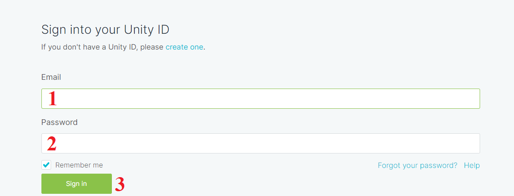

* Enter your E-mail address
* Enter your password
* Click on Sign in

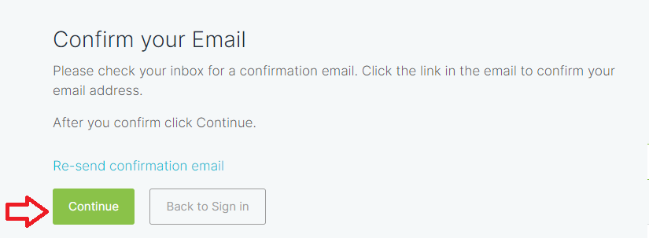

* Confirm your Email
* Click on Continue
* Unity Hub opens

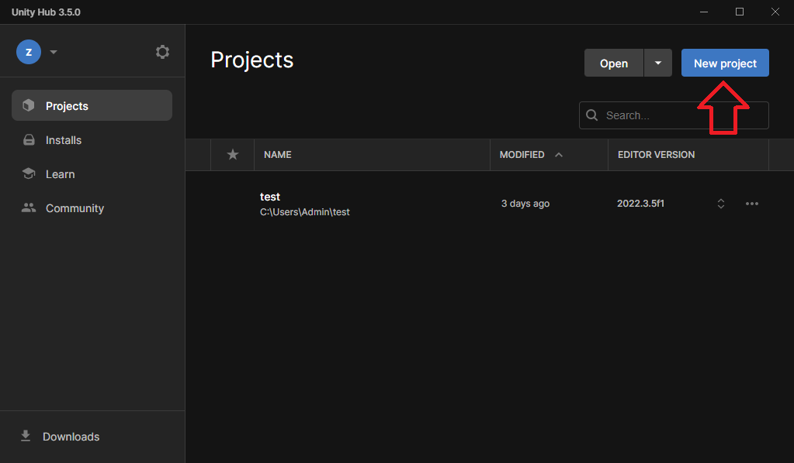
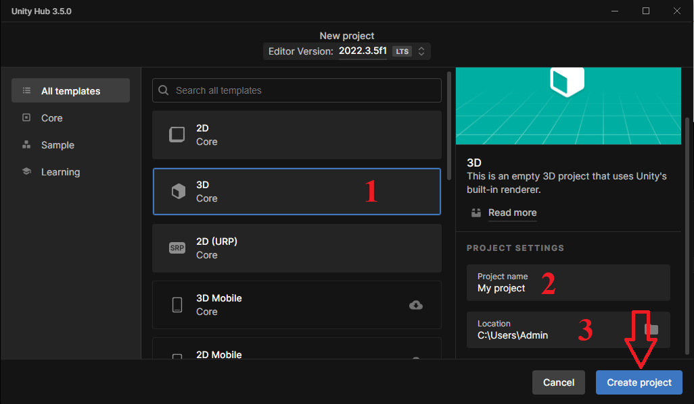

* Click on New project
* Click on 3-D
* Enter the project name
* Select the project location
* Click on Create project

## 6. Working in Unity Hub Editor

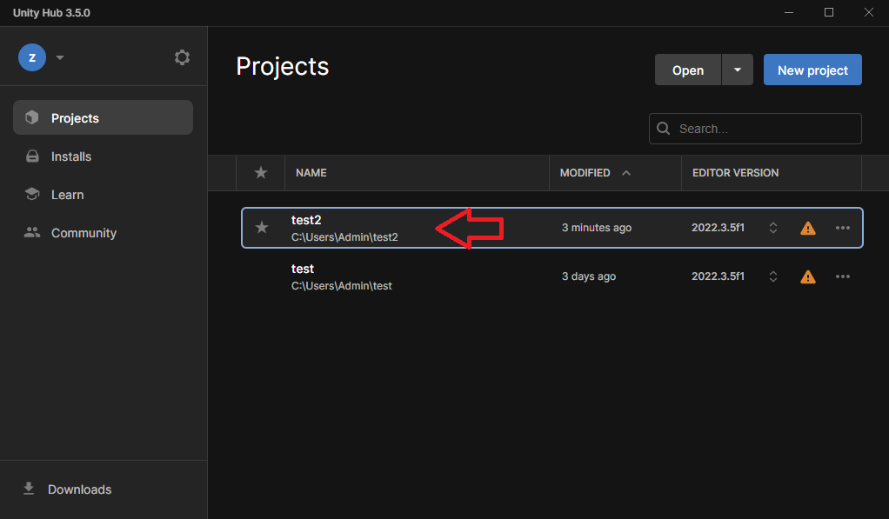

* Click on the newly created project
* Click on Install Version...
> After downloading Unity Editor, go back to Unity Hub and open your project again. The project will open in Unity Editor.

* Open [Unity Asset Store](https://assetstore.unity.com/packages/essentials/starter-assets-third-person-character-controller-urp-196526) site

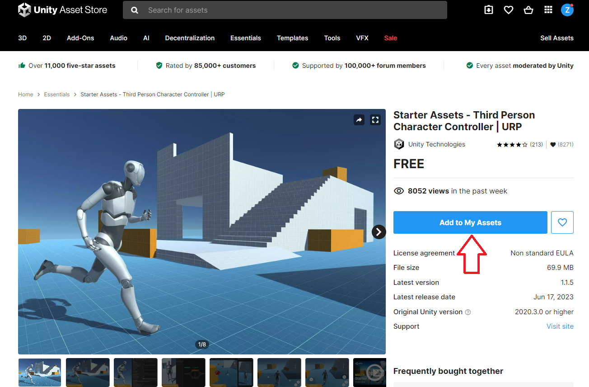
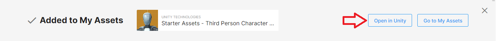
* Click on Add to my Assets
* Click on Open in Unity

> Unity Editor opens

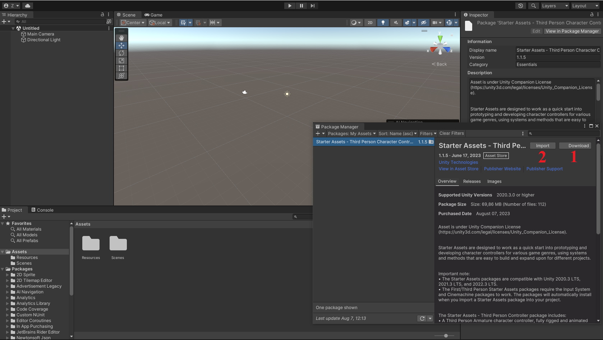
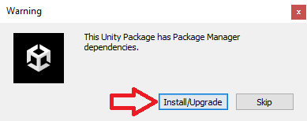

* Click on Download
* When downloading ends, click on Import
* Click on Install/Upgrade
> After installation, Unity Editor will be restart

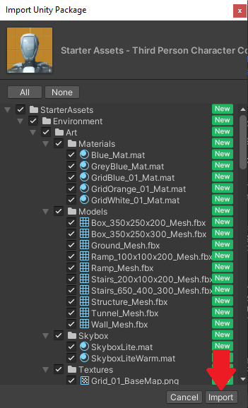

* Click on Import
> Starter Assets will be added to folders

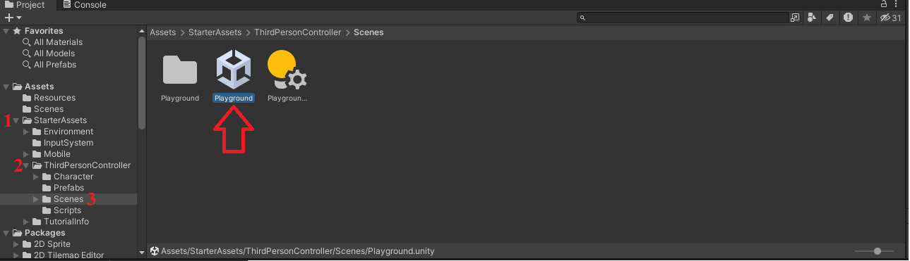

* Drop down the StarterAssets folder
* Drop down the ThirdPersonController folder
* Click on Scenes folder
* Double click on Playground

> Scene will be open
