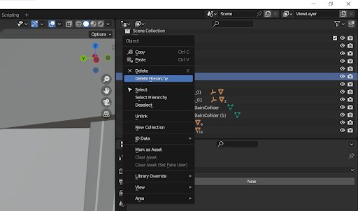
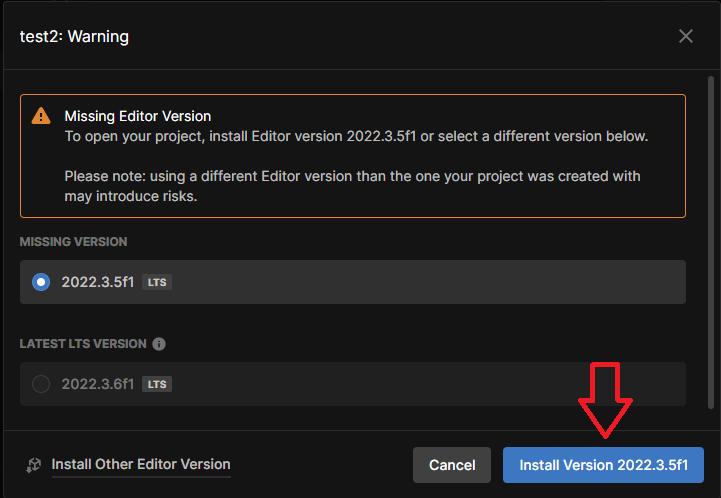
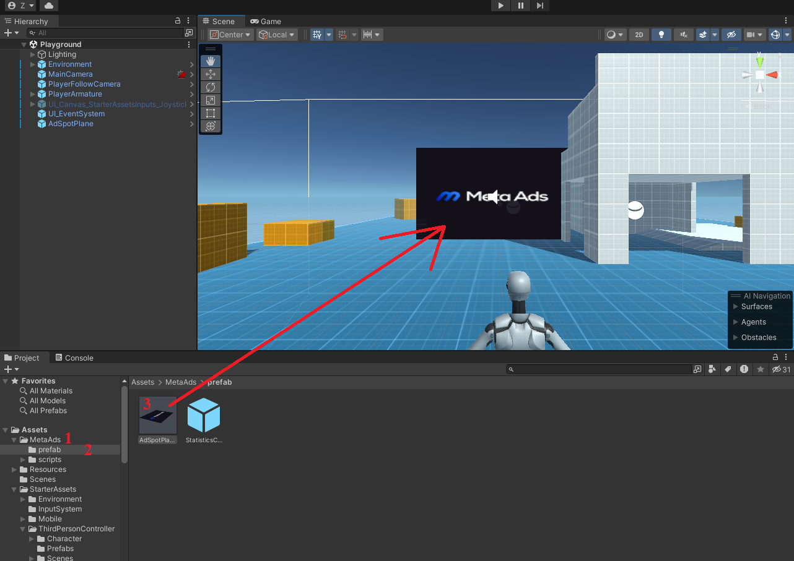

# MetaAds Unity's Scene
## Intoduction
This document is an instruction on how to create a scene for *Unity*.
## 1. Opening the **MetaAds** website
* Connect
* Click on *Landowner*
* Click on *My Ad Spaces*

## 2. Metaverse selected. Assets downloaded
* Click on *Add Ad Space* (1)
* Click on select metaverse (2)
* Select *Voxels* metaverse (3)
* Click on *Download* and save file on PC(4)
* Click on Next (5)

     

## 3. Downloading Unity Hub and creating new account
* Download [Unity Hub](https://unity.com/download) from official site 
* Go to [Unity ID](https://id.unity.com/en/conversations/9436941f-b52e-4612-9ba9-f515d1fe1b13009f) site and create new account

* Click on *Create one* (1)
* Enter your *e-mail* address (You will receive a confirmation email on this address) (2)
* Specify and enter *Username* (Your username is for your Unity Community profile) (3)
* Specify and enter *Password* (4)
* Enter your *Full Name* (5)
* Check all the consents (6)
* Click on *Create a Unity ID* (7)

  

###  Unity Hub. Log in and creating the project
* Enter your *E-mail* (1)
* Enter your *password* (2)
* Click on *Sign in* (3)

* Confirm your *E-mail* 
* Click on *Continue* 
> *Unity Hub* opens 

* Click on *New project*
* Click on *3-D* (1)
* Enter the *Project name* (2)
* Select the *Project location*
* Click on Create project

## 4. Working in Unity Hub Editor
### Creating the project
* Click on the newly created project
* Click on *Install Version* ...

> After downloading *Unity Editor*, go back to *Unity Hub* and open your project again. The project will open in *Unity Editor*.

### Downloading and importing assets
* Open [**Unity Asset Store**](https://assetstore.unity.com/packages/essentials/starter-assets-third-person-character-controller-urp-196526) site
* Click on *Add to my Assets*
* Click on *Open in Unity*

> Unity Editor opens.

* Click on *Download* (1)
* When downloading ends, click on *Import* (2)
* Click on *Install/Upgrade*

> After installation, *Unity Editor* will be restart.

* Click on *Import*
  

> Starter Assets will be added to folders.

* Drop down the *StarterAssets* folder (1)
* Drop down the *ThirdPersonController* folder (2)
* Click on *Scenes* folder (3)
* Double click on *Playground*

> Scene will be open. Now let's load MetaAds assets.

* In the list of folders, right-click on *Assets* (1)
* Click on *Import Package* (2)
* Click on *Custom Package* 
* Select asset downloaded from *MetaAds*

> The *MetaAds* folder and files will be added to the list.

* Go to the *MetaAds* folder (1)
* Next the *Prefab* folder (2)
* Drag the *AdSpotPlane* file to any wall on the scene (3)

> On some versions of *Unity*, it is necessary to restart the project after installing the asset so that all textures are picked up.

### Configuring the MetaAds Screen

* Click on MetaAds screen (1)
* Click on Move tool in Tools tab
* Click on Y-orientation 

* Pull the green arrow and align the screen with the coordinate arrows so that it is slightly in front of the wall on which it is located (2)
* Return the default orientation

* Click on Rect tool in Tools tab
* Use the dots on the corners  to align it to the size of the wall

> The scene with the *MetaAds* screen is ready!

## 5. Completing the creation of the scene
 
* Click on the *MetaAds* screen (1)
* Find the *Unique ID* (Script) section in *Inspector* (2)
* Copy the *Unique ID*

> Go back to "Create New Ad Space" pop up on Meta Ads website.

* Enter Name (1)
* Paste *Ad Space UUID* (2)
* Enter Exernal target link (3) (is optional)
* Enter *description* (4)
* Enter *jump URL* (5) (is optional)
* Upload *Preview Image* (6)
* Upload *Default Ad Image* (7) (is optional)
* You can choose to enable moderation or not (8) (is optional)
* Click on *Save* (9)

 

> <u>EXPECTED STATE</u>: The created *Unity Ad Space*  will appear on the *My Ad Spaces* tab. You can start campaigns. Available for *Unity* - picture creatives, video creatives, stream creatives.    
