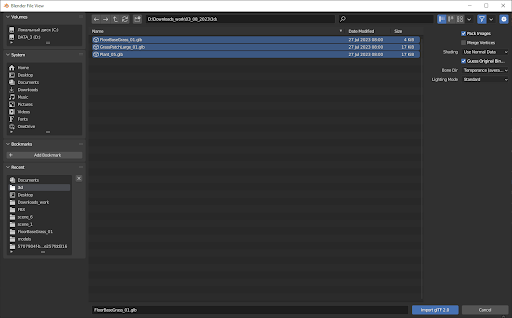
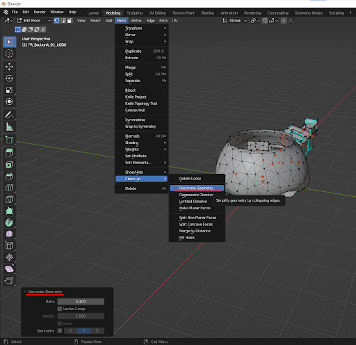

# Scene Model Uploading

## 1. Instructions for preparing a model for 3D analytics
How you prepare the model will determine the accuracy of the analytics display, as well as the speed of loading the model during the analysis.
The instruction was written for the *Blender* program (available for *Windows, MacOs, Linux* (Free and Open Source)). If you have the skills, you can do this in any other program.

* Click File 
* Click *Import* 
* Select model format and click on it

If the scene consists of several models, select all. Usually, if you exported a scene from the game engine, the output is either one model or several models (and when imported into blender, they fall into place). If suddenly the models do not fall into place, you need to position them.

Remove unnecessary items (often there are a lot of unnecessary items on the scenes that are not needed to understand the analytics)

Delete materials (materials can be left only on the AdSpots to better see the statistics). Select the item on which we want to remove the material, then the Material properties tab, then select the material and click delete (-).

Reduce the number of polygons in the model, while maintaining its overall shape and quality. Select the model you want to scale down and enter edit mode by pressing the Tab key.
Select the entire object by pressing the A key to select all model vertices.

* Open the *Mesh* 
* Click *Cleanup*  
* Select *Geometry*

In the appeared window *Decimate* you will see various options for reducing polygons:

*Ratio*: This option allows you to set the percentage reduction in the number of polygons. For example, if you set the value to 0.5, the model will be reduced to 50% of the original poly count.
(This is usually enough)

*Planar*: If you want to keep flatter surfaces, check this option. It allows you to merge close vertices to reduce the number of polygons.

*Collapse Mode*: You can select different collapse modes for decimation.
Experiment with different values and options to achieve the desired level of polygon reduction while maintaining acceptable model quality. After adjusting the decimate settings, click the 

*Decimate* button to apply the changes. (Depending on Blender version, this button may not be present)

* Click *File*
* Click *Export* 
* Click *Fbx* (Object types select only Mesh)

Usually these steps are enough to significantly reduce the volume of the model.

> Your scene should already be displayed on the *MetaAds* site in the *My Scenes* section.

## 2. Overview *My Scenes* section on **MetaAds** and editing created scene

* Go to the [**MetaAds** site](https://metaads.team/main/)
* Click on *Landowner* (1)
* Click on *My Scenes* (2)
* Click on 6 dots on your scene (3)
* Click on *Edit* (4)

* Enter *Name*
* Enter *Description*
* Upload *Preview Image*
* Upload *Scene file* created in *Blender* program

##

> Ready! You will see the changes after saving the changes. And the message "The Scene successfully edited" will show up.

