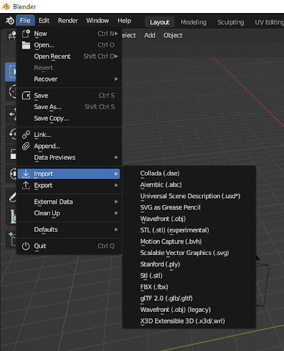

# MetaAds Unity's Scene
## Intoduction
This document is an instruction on how to create a scene for Unity.
## 1. Opening the MetaAds website
* Connect
* Click on Landowner
* Click on My Ad Spaces

## 2. Metaverse selected. Assets downloaded
     
* Click on Add Ad Space
* Click on select metaverse
* Choose Voxel metaverse
* Click on Download
    * Save file on PC
* Click on Next
## 3. Creating Ad Space and entering data
 
* Enter Name
* Enter Exernal target link (is optional)
* Enter description
* Enter jump URL (is optional)
* Upload Preview Image
* Click Save