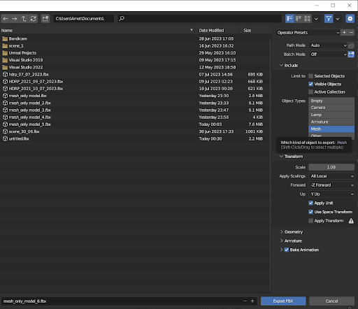
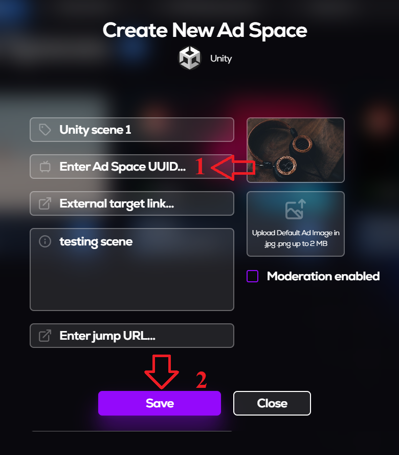

# MetaAds Unity's Scene
## Intoduction
This document is an instruction on how to create a scene for Unity.
## 1. Opening the MetaAds website
* Connect
* Click on Landowner
* Click on My Ad Spaces

## 2. Metaverse selected. Assets downloaded
     
* Click on Add Ad Space
* Click on select metaverse
* Choose Voxel metaverse
* Click on Download
    * Save file on PC
* Click on Next
###  Creating Ad Space and entering data
 
* Enter Name
* Enter Exernal target link (is optional)
* Enter description
* Enter jump URL (is optional)
* Upload Preview Image

> To get the Add space UUID, you need to create a scene in Unity Hub.
## 4. Downloading Unity Hub and creating new account
* Download [Unity Hub](https://unity.com/download) from official site 
* Go to [Unity ID](https://id.unity.com/en/conversations/9436941f-b52e-4612-9ba9-f515d1fe1b13009f) site and create new account

  

* Click on create one 
* Enter your e-mail address (You will receive a confirmation email on this address)
* Think of and enter Username (Your username is for your Unity Community profile)
* Think of and enter Password 
* Check all the consents
* Go trought the capcha
* Click on Create a Unity ID

###  Unity Hub. Log in and creating the project

* Enter your E-mail address
* Enter your password
* Click on Sign in

* Confirm your Email
* Click on Continue
* Unity Hub opens

* Click on New project
* Click on 3-D
* Enter the project name
* Select the project location
* Click on Create project

## 6. Working in Unity Hub Editor
### Creating the project

* Click on the newly created project
* Click on Install Version...
> After downloading Unity Editor, go back to Unity Hub and open your project again. The project will open in Unity Editor.
### Downloading and importing assets
* Open [Unity Asset Store](https://assetstore.unity.com/packages/essentials/starter-assets-third-person-character-controller-urp-196526) site

* Click on Add to my Assets
* Click on Open in Unity

> Unity Editor opens.

* Click on Download
* When downloading ends, click on Import
* Click on Install/Upgrade
> After installation, Unity Editor will be restart.

* Click on Import
> Starter Assets will be added to folders.

* Drop down the StarterAssets folder
* Drop down the ThirdPersonController folder
* Click on Scenes folder
* Double click on Playground

> Scene will be open. Now let's load MetaAds assets.

* In the list of folders, right-click on Assets
* Click on Import Package
* Click on Custom Package
* Select asset downloaded from MetaAds

> The MetaAds folder and files will be added to the list.

* Go to the MetaAds folder
* Next the Prefab folder
* Drag the AdSpotPlane file to any wall on the scene

> On some versions of Unity, it is necessary to restart the project after installing the asset so that all textures are picked up.

### Configuring the MetaAds Screen

* Click on MetaAds screen
* Click on Move tool in Tools tab
* Click on Y-orientation 
* Pull the green arrow and align the screen with the coordinate arrows so that it is slightly in front of the wall on which it is located
* Return the default orientation
* Click on Rect tool in Tools tab
* Use the dots on the corners  to align it to the size of the wall

> The scene with the MetaAds screen is ready!

## Completing the creation of the scene
### 

* Click on the MetaAds screen
* Find the Unique ID (Script) section in Inspector
* Copy the Unique ID

> Go back to "Create New Ad Space" pop up on Meta Ads website.

* Paste Ad Space UUID
* Click on Save

<u>EXPECTED RESULT</u>: The created Ad Space will appear on the My Ad Spaces tab.
